# DATABASE_STRUCTURE.md — MySQL Database Reference

This document is the definitive reference for the ChainIQ normalised MySQL database hosted on AWS RDS. Use it when writing queries, building backend services, or debugging data issues.

The database was populated by `database_init/migrate.py` from the 6 raw data files in `data/`. All schema inconsistencies from the source files have been resolved during migration.

---

## Connection

Environment variables (stored in `database_init/.env`):

| Variable | Description |
|----------|-------------|
| `DB_HOST` | RDS endpoint |
| `DB_PORT` | Port (default 3306) |
| `DB_USER` | Database user |
| `DB_PASSWORD` | Database password |
| `DB_NAME` | Database name |

---

## Schema Overview

41 tables across 10 groups. All tables use InnoDB engine with utf8mb4 charset.

| Group | Tables | Row counts |
|-------|--------|------------|
| Reference data | `categories`, `suppliers`, `supplier_categories`, `supplier_service_regions`, `pricing_tiers` | 30 + 40 + 151 + 376 + 599 |
| Requests | `requests`, `request_delivery_countries`, `request_scenario_tags` | 304 + 416 + 305 |
| Historical | `historical_awards` | 590 |
| Approval thresholds | `approval_thresholds`, `approval_threshold_managers`, `approval_threshold_deviation_approvers` | 15 + 18 + 8 |
| Preferred/restricted | `preferred_suppliers_policy`, `preferred_supplier_region_scopes`, `restricted_suppliers_policy`, `restricted_supplier_scopes` | 61 + 102 + 5 + 9 |
| Rules | `category_rules`, `geography_rules`, `geography_rule_countries`, `geography_rule_applies_to_categories`, `escalation_rules`, `escalation_rule_currencies` | 10 + 8 + 12 + 9 + 8 + 1 |
| Dynamic rules | `dynamic_rules`, `dynamic_rule_versions`, `rule_evaluation_results` | 30 + 30 + dynamic |
| Evaluation engine | `rule_definitions`, `rule_versions`, `evaluation_runs`, `hard_rule_checks`, `policy_checks`, `supplier_evaluations`, `escalations` | dynamic |
| Pipeline results | `pipeline_results` | dynamic |
| Audit / logging | `pipeline_runs`, `pipeline_log_entries`, `audit_logs`, `rule_change_logs`, `escalation_logs`, `policy_change_logs`, `evaluation_run_logs`, `policy_check_logs` | dynamic |

---

## Entity Relationship Diagram

```mermaid
erDiagram
    categories ||--o{ supplier_categories : "has"
    categories ||--o{ pricing_tiers : "priced_for"
    categories ||--o{ category_rules : "governed_by"
    categories ||--o{ requests : "requested"
    categories ||--o{ historical_awards : "awarded_in"

    suppliers ||--o{ supplier_categories : "serves"
    suppliers ||--o{ supplier_service_regions : "operates_in"
    suppliers ||--o{ pricing_tiers : "offers"
    suppliers ||--o{ historical_awards : "awarded_to"
    suppliers ||--o{ preferred_suppliers_policy : "preferred"
    suppliers ||--o{ restricted_suppliers_policy : "restricted"
    suppliers ||--o{ hard_rule_checks : "checked_against"
    suppliers ||--o{ supplier_evaluations : "evaluated"

    requests ||--o{ request_delivery_countries : "delivers_to"
    requests ||--o{ request_scenario_tags : "tagged_as"
    requests ||--o{ historical_awards : "evaluated_by"
    requests ||--o{ evaluation_runs : "processed_by"
    requests ||--o{ pipeline_runs : "logged_by"
    requests ||--o{ audit_logs : "audited_by"

    approval_thresholds ||--o{ approval_threshold_managers : "managed_by"
    approval_thresholds ||--o{ approval_threshold_deviation_approvers : "deviation_requires"

    preferred_suppliers_policy ||--o{ preferred_supplier_region_scopes : "scoped_to"

    restricted_suppliers_policy ||--o{ restricted_supplier_scopes : "restricted_in"

    geography_rules ||--o{ geography_rule_countries : "applies_in"
    geography_rules ||--o{ geography_rule_applies_to_categories : "applies_to"

    escalation_rules ||--o{ escalation_rule_currencies : "applies_for"

    rule_definitions ||--o{ rule_versions : "versioned_as"
    rule_definitions ||--o{ hard_rule_checks : "defines"
    rule_definitions ||--o{ policy_checks : "defines"
    rule_definitions ||--o{ rule_change_logs : "tracked_by"

    rule_versions ||--o{ hard_rule_checks : "used_in"
    rule_versions ||--o{ policy_checks : "used_in"
    rule_versions ||--o{ escalations : "triggered_by"
    rule_versions ||--o{ rule_change_logs : "new_version"

    evaluation_runs ||--o{ hard_rule_checks : "contains"
    evaluation_runs ||--o{ policy_checks : "contains"
    evaluation_runs ||--o{ supplier_evaluations : "produces"
    evaluation_runs ||--o{ escalations : "triggers"
    evaluation_runs ||--o{ evaluation_run_logs : "logged_by"
    evaluation_runs ||--o{ policy_check_logs : "logged_by"

    policy_checks ||--o{ policy_check_logs : "tracked_by"

    escalations ||--o{ escalation_logs : "logged_by"
    escalations ||--o{ policy_change_logs : "changes"

    requests ||--o{ pipeline_results : "result_of"

    pipeline_runs ||--o{ pipeline_log_entries : "contains"
```



---

## 1. Reference Data Tables

### 1.1 `categories`

The category taxonomy. 30 rows defining all valid L1/L2 combinations.

| Column | Type | Nullable | Description |
|--------|------|----------|-------------|
| `id` | INT AUTO_INCREMENT | No | **PK** |
| `category_l1` | VARCHAR(50) | No | Top-level: `IT`, `Facilities`, `Professional Services`, `Marketing` |
| `category_l2` | VARCHAR(80) | No | Subcategory (30 values) |
| `category_description` | VARCHAR(255) | No | Human-readable description |
| `typical_unit` | VARCHAR(30) | No | Expected unit of measure (`device`, `consulting_day`, `campaign`, etc.) |
| `pricing_model` | VARCHAR(30) | No | Expected pricing model (`tiered`, `fixed`, `usage`, `subscription`, `day_rate`, `blended_rate`, `performance`) |

**Constraints:** UNIQUE(`category_l1`, `category_l2`)

**Source:** `data/categories.csv`

### 1.2 `suppliers`

40 unique suppliers. Deduplicated from the raw CSV (which had 151 rows, one per supplier-category pair).

| Column | Type | Nullable | Description |
|--------|------|----------|-------------|
| `supplier_id` | VARCHAR(20) | No | **PK**. Format: `SUP-NNNN` |
| `uuid` | VARCHAR(36) | No | Auto-generated UUIDv4. UNIQUE |
| `supplier_name` | VARCHAR(120) | No | |
| `country_hq` | VARCHAR(5) | No | ISO 2-letter country code of HQ |
| `currency` | VARCHAR(5) | No | Currency the supplier prices in (`EUR`, `CHF`, `USD`) |
| `contract_status` | VARCHAR(20) | No | All `active` in current dataset |
| `capacity_per_month` | INT | No | Max units per month (shared across all categories) |

**Source:** `data/suppliers.csv` (deduplicated by `supplier_id`)

### 1.3 `supplier_categories`

151 rows. Each row is one supplier serving one category, with per-category scores.

| Column | Type | Nullable | Description |
|--------|------|----------|-------------|
| `id` | INT AUTO_INCREMENT | No | **PK** |
| `supplier_id` | VARCHAR(20) | No | **FK** -> `suppliers.supplier_id` |
| `category_id` | INT | No | **FK** -> `categories.id` |
| `pricing_model` | VARCHAR(30) | No | |
| `quality_score` | INT | No | 0-100, **higher is better** |
| `risk_score` | INT | No | 0-100, **lower is better** |
| `esg_score` | INT | No | 0-100, **higher is better** |
| `preferred_supplier` | BOOLEAN | No | Whether preferred for this category |
| `is_restricted` | BOOLEAN | No | Hint only -- always cross-reference `restricted_suppliers_policy` |
| `restriction_reason` | TEXT | Yes | Empty if not restricted |
| `data_residency_supported` | BOOLEAN | No | Whether supplier supports in-country data residency |
| `notes` | TEXT | Yes | |

**Constraints:** UNIQUE(`supplier_id`, `category_id`)

**Source:** `data/suppliers.csv` (one row per supplier-category pair)

### 1.4 `supplier_service_regions`

Junction table. Normalised from the semicolon-delimited `service_regions` column in the raw CSV.

| Column | Type | Nullable | Description |
|--------|------|----------|-------------|
| `supplier_id` | VARCHAR(20) | No | **PK** (composite), **FK** -> `suppliers.supplier_id` |
| `country_code` | VARCHAR(5) | No | **PK** (composite). ISO 2-letter country code |

**How to use:** To check if a supplier covers a delivery country:

```sql
SELECT 1
FROM supplier_service_regions
WHERE supplier_id = 'SUP-0001' AND country_code = 'DE';
```

**Source:** `data/suppliers.csv` `service_regions` column (split on `;`)

### 1.5 `pricing_tiers`

599 pricing tiers. Each row is a price point for a specific supplier + category + region + quantity range.

| Column | Type | Nullable | Description |
|--------|------|----------|-------------|
| `pricing_id` | VARCHAR(20) | No | **PK**. Format: `PR-NNNNN` |
| `supplier_id` | VARCHAR(20) | No | **FK** -> `suppliers.supplier_id` |
| `category_id` | INT | No | **FK** -> `categories.id` |
| `region` | VARCHAR(20) | No | One of: `EU`, `CH`, `Americas`, `APAC`, `MEA` |
| `currency` | VARCHAR(5) | No | |
| `pricing_model` | VARCHAR(30) | No | |
| `min_quantity` | INT | No | Lower bound of tier (inclusive) |
| `max_quantity` | INT | No | Upper bound of tier (inclusive) |
| `unit_price` | DECIMAL(12,4) | No | Standard price per unit |
| `moq` | INT | No | Minimum order quantity |
| `standard_lead_time_days` | INT | No | Working days for standard delivery |
| `expedited_lead_time_days` | INT | No | Working days for fast delivery |
| `expedited_unit_price` | DECIMAL(12,4) | No | ~8% premium over standard |
| `valid_from` | DATE | No | All rows: 2026-01-01 |
| `valid_to` | DATE | No | All rows: 2026-12-31 |
| `notes` | TEXT | Yes | |

**Indexes:** `idx_pricing_lookup(supplier_id, category_id, region)`

**Source:** `data/pricing.csv`

#### Country-to-Region Mapping

Use this mapping to convert a delivery country to the `region` value for pricing lookups:

| Region | Countries |
|--------|-----------|
| `EU` | DE, FR, NL, BE, AT, IT, ES, PL, UK |
| `CH` | CH |
| `Americas` | US, CA, BR, MX |
| `APAC` | SG, AU, IN, JP |
| `MEA` | UAE, ZA |

#### How to Look Up a Price

```sql
SELECT pt.unit_price, pt.expedited_unit_price,
       pt.standard_lead_time_days, pt.expedited_lead_time_days
FROM pricing_tiers pt
JOIN categories c ON pt.category_id = c.id
WHERE pt.supplier_id = :supplier_id
  AND c.category_l1 = :category_l1
  AND c.category_l2 = :category_l2
  AND pt.region = :region
  AND pt.min_quantity <= :quantity
  AND pt.max_quantity >= :quantity;
```

---

## 2. Request Tables

### 2.1 `requests`

304 purchase requests. The core input to the procurement agent.

| Column | Type | Nullable | Description |
|--------|------|----------|-------------|
| `request_id` | VARCHAR(20) | No | **PK**. Format: `REQ-NNNNNN` |
| `uuid` | VARCHAR(36) | No | Auto-generated UUIDv4. UNIQUE |
| `created_at` | DATETIME | No | UTC timestamp |
| `request_channel` | VARCHAR(20) | No | `portal`, `teams`, or `email` |
| `request_language` | VARCHAR(5) | No | `en`, `fr`, `de`, `es`, `pt`, `ja` |
| `business_unit` | VARCHAR(80) | No | Internal department |
| `country` | VARCHAR(5) | No | ISO 2-letter code of requester |
| `site` | VARCHAR(80) | No | Office location |
| `requester_id` | VARCHAR(20) | No | Format: `USR-NNNN` |
| `requester_role` | VARCHAR(80) | Yes | May be NULL for some requests |
| `submitted_for_id` | VARCHAR(20) | No | May differ from `requester_id` |
| `category_id` | INT | No | **FK** -> `categories.id` |
| `title` | VARCHAR(255) | No | Short title |
| `request_text` | TEXT | No | Free-text body. May be non-English. May contradict structured fields. |
| `currency` | VARCHAR(5) | No | `EUR`, `CHF`, or `USD` |
| `budget_amount` | DECIMAL(14,2) | **Yes** | NULL = missing info (escalation ER-001) |
| `quantity` | DECIMAL(14,2) | **Yes** | NULL = missing info. May contradict `request_text` |
| `unit_of_measure` | VARCHAR(30) | No | Matches `categories.typical_unit` |
| `required_by_date` | DATE | No | May be unrealistically tight |
| `preferred_supplier_mentioned` | VARCHAR(120) | Yes | Supplier name (not ID). May be restricted/wrong category |
| `incumbent_supplier` | VARCHAR(120) | Yes | Currently contracted supplier |
| `contract_type_requested` | VARCHAR(40) | No | |
| `data_residency_constraint` | BOOLEAN | No | If true, data must stay in-country |
| `esg_requirement` | BOOLEAN | No | If true, ESG scores matter more in ranking |
| `status` | VARCHAR(20) | No | All `new` in current dataset |

**Indexes:** `idx_req_category(category_id)`, `idx_req_country(country)`

**Source:** `data/requests.json`

### 2.2 `request_delivery_countries`

Junction table. Each request can deliver to multiple countries.

| Column | Type | Nullable | Description |
|--------|------|----------|-------------|
| `id` | INT AUTO_INCREMENT | No | **PK** |
| `request_id` | VARCHAR(20) | No | **FK** -> `requests.request_id` |
| `country_code` | VARCHAR(5) | No | ISO 2-letter code |

**Constraints:** UNIQUE(`request_id`, `country_code`)

**Source:** `data/requests.json` `delivery_countries` array

### 2.3 `request_scenario_tags`

Junction table. Tags describe the type of edge case a request represents.

| Column | Type | Nullable | Description |
|--------|------|----------|-------------|
| `id` | INT AUTO_INCREMENT | No | **PK** |
| `request_id` | VARCHAR(20) | No | **FK** -> `requests.request_id` |
| `tag` | VARCHAR(30) | No | See tag values below |

**Constraints:** UNIQUE(`request_id`, `tag`)

**Tag values:** `standard`, `threshold`, `lead_time`, `missing_info`, `contradictory`, `restricted`, `multilingual`, `capacity`, `multi_country`

**Source:** `data/requests.json` `scenario_tags` array

---

## 3. Historical Awards Table

### 3.1 `historical_awards`

590 rows covering 180 of 304 requests. Multiple rows per request (winner + evaluated alternatives). 124 requests have no historical awards.

| Column | Type | Nullable | Description |
|--------|------|----------|-------------|
| `award_id` | VARCHAR(20) | No | **PK**. Format: `AWD-NNNNNN` |
| `request_id` | VARCHAR(20) | No | **FK** -> `requests.request_id` |
| `award_date` | DATE | No | Decision date |
| `category_id` | INT | No | **FK** -> `categories.id` |
| `country` | VARCHAR(5) | No | |
| `business_unit` | VARCHAR(80) | No | |
| `supplier_id` | VARCHAR(20) | No | **FK** -> `suppliers.supplier_id` |
| `supplier_name` | VARCHAR(120) | No | Denormalised for convenience |
| `total_value` | DECIMAL(14,2) | No | Total contract value |
| `currency` | VARCHAR(5) | No | |
| `quantity` | DECIMAL(14,2) | No | |
| `required_by_date` | DATE | No | |
| `awarded` | BOOLEAN | No | `TRUE` = winner, `FALSE` = evaluated alternative |
| `award_rank` | INT | No | 1 = recommended winner |
| `decision_rationale` | TEXT | No | Human-readable reasoning |
| `policy_compliant` | BOOLEAN | No | |
| `preferred_supplier_used` | BOOLEAN | No | |
| `escalation_required` | BOOLEAN | No | |
| `escalated_to` | VARCHAR(80) | Yes | NULL if no escalation |
| `savings_pct` | DECIMAL(6,2) | No | % savings vs budget. 0.0 for non-winners |
| `lead_time_days` | INT | No | |
| `risk_score_at_award` | INT | No | Snapshot at decision time |
| `notes` | TEXT | Yes | |

**Indexes:** `idx_award_request(request_id)`, `idx_award_supplier(supplier_id)`

**Source:** `data/historical_awards.csv`

---

## 4. Policy Tables

All policy data originates from `data/policies.json`. The raw file had **inconsistent schemas between currencies and between rule groups** -- these have all been normalised during migration.

### 4.1 `approval_thresholds`

15 rows. Determines approval level and required supplier quotes based on contract value and currency.

| Column | Type | Nullable | Description |
|--------|------|----------|-------------|
| `threshold_id` | VARCHAR(20) | No | **PK**. Format: `AT-NNN` |
| `currency` | VARCHAR(5) | No | `EUR`, `CHF`, or `USD` |
| `min_amount` | DECIMAL(14,2) | No | Lower bound of tier (inclusive) |
| `max_amount` | DECIMAL(14,2) | **Yes** | Upper bound (inclusive). NULL for AT-015 (USD top tier, no cap) |
| `min_supplier_quotes` | INT | No | Number of quotes required |
| `policy_note` | TEXT | Yes | Additional policy context (present for USD thresholds) |

**Index:** `idx_threshold_currency(currency)`

**Normalisation applied:** USD entries originally used `min_value`/`max_value`/`quotes_required` instead of `min_amount`/`max_amount`/`min_supplier_quotes`. These were mapped to the common field names.

#### Threshold Tiers Summary

| Tier | EUR Range | CHF Range | USD Range | Quotes | Approver |
|------|-----------|-----------|-----------|--------|----------|
| 1 | 0 -- 24,999 | 0 -- 24,999 | 0 -- 27,000 | 1 | Business |
| 2 | 25,000 -- 99,999 | 25,000 -- 99,999 | 27,000 -- 108,000 | 2 | Business + Procurement |
| 3 | 100,000 -- 499,999 | 100,000 -- 499,999 | 108,000 -- 540,000 | 3 | Head of Category |
| 4 | 500,000 -- 4,999,999 | 500,000 -- 4,999,999 | 540,000 -- 5,400,000 | 3 | Head of Strategic Sourcing |
| 5 | 5,000,000+ | 5,000,000+ | 5,400,000+ | 3 | CPO |

#### How to Determine the Approval Tier

```sql
SELECT at.threshold_id, at.min_supplier_quotes, at.policy_note,
       GROUP_CONCAT(DISTINCT atm.manager_role) AS managed_by,
       GROUP_CONCAT(DISTINCT atda.approver_role) AS deviation_approvers
FROM approval_thresholds at
LEFT JOIN approval_threshold_managers atm ON at.threshold_id = atm.threshold_id
LEFT JOIN approval_threshold_deviation_approvers atda ON at.threshold_id = atda.threshold_id
WHERE at.currency = :currency
  AND at.min_amount <= :total_value
  AND (at.max_amount IS NULL OR at.max_amount >= :total_value)
GROUP BY at.threshold_id;
```

### 4.2 `approval_threshold_managers`

Junction table linking thresholds to the roles that manage them.

| Column | Type | Nullable | Description |
|--------|------|----------|-------------|
| `id` | INT AUTO_INCREMENT | No | **PK** |
| `threshold_id` | VARCHAR(20) | No | **FK** -> `approval_thresholds.threshold_id` |
| `manager_role` | VARCHAR(80) | No | e.g. `business`, `procurement`, `head_of_strategic_sourcing`, `cpo` |

**Normalisation applied:** EUR/CHF used `managed_by`, USD used `approvers`. Both mapped to `manager_role`.

### 4.3 `approval_threshold_deviation_approvers`

Junction table for who must approve deviations from policy.

| Column | Type | Nullable | Description |
|--------|------|----------|-------------|
| `id` | INT AUTO_INCREMENT | No | **PK** |
| `threshold_id` | VARCHAR(20) | No | **FK** -> `approval_thresholds.threshold_id` |
| `approver_role` | VARCHAR(80) | No | e.g. `Procurement Manager`, `Head of Category`, `CPO` |

**Note:** EUR/CHF entries have this data from `deviation_approval_required_from`. USD entries only have `policy_note` text (the deviation approver data is embedded in the note, not as a structured array). Only EUR/CHF entries populate this table.

### 4.4 `preferred_suppliers_policy`

61 rows. Each row maps a supplier to a category where it is preferred.

| Column | Type | Nullable | Description |
|--------|------|----------|-------------|
| `id` | INT AUTO_INCREMENT | No | **PK** |
| `supplier_id` | VARCHAR(20) | No | **FK** -> `suppliers.supplier_id` |
| `category_l1` | VARCHAR(50) | No | |
| `category_l2` | VARCHAR(80) | No | |
| `policy_note` | TEXT | Yes | |

**Index:** `idx_pref_supplier(supplier_id)`

### 4.5 `preferred_supplier_region_scopes`

Junction table. Defines which regions a preferred-supplier policy applies to. If a policy entry has **no rows here**, the supplier is preferred globally (entries for SUP-0009, SUP-0015, SUP-0025, SUP-0046, SUP-0047).

| Column | Type | Nullable | Description |
|--------|------|----------|-------------|
| `id` | INT AUTO_INCREMENT | No | **PK** |
| `preferred_suppliers_policy_id` | INT | No | **FK** -> `preferred_suppliers_policy.id` |
| `region` | VARCHAR(20) | No | e.g. `EU`, `CH` |

#### How to Check if a Supplier is Preferred for a Request

```sql
SELECT psp.id, psp.supplier_id, psp.policy_note
FROM preferred_suppliers_policy psp
LEFT JOIN preferred_supplier_region_scopes psrs ON psp.id = psrs.preferred_suppliers_policy_id
WHERE psp.supplier_id = :supplier_id
  AND psp.category_l1 = :category_l1
  AND psp.category_l2 = :category_l2
  AND (psrs.region IS NULL OR psrs.region = :region);
-- psrs.region IS NULL covers globally-preferred suppliers (no region_scope entries)
```

### 4.6 `restricted_suppliers_policy`

5 rows. Suppliers with procurement restrictions.

| Column | Type | Nullable | Description |
|--------|------|----------|-------------|
| `id` | INT AUTO_INCREMENT | No | **PK** |
| `supplier_id` | VARCHAR(20) | No | **FK** -> `suppliers.supplier_id` |
| `category_l1` | VARCHAR(50) | No | |
| `category_l2` | VARCHAR(80) | No | |
| `restriction_reason` | TEXT | No | Human-readable reason |

**Index:** `idx_rest_supplier(supplier_id)`

### 4.7 `restricted_supplier_scopes`

Junction table defining where restrictions apply.

| Column | Type | Nullable | Description |
|--------|------|----------|-------------|
| `id` | INT AUTO_INCREMENT | No | **PK** |
| `restricted_suppliers_policy_id` | INT | No | **FK** -> `restricted_suppliers_policy.id` |
| `scope_value` | VARCHAR(10) | No | ISO country code, or `all` for global restriction |

**Restriction types:**
- **Country-scoped:** `scope_value` is a country code (e.g. `CH`, `DE`)
- **Global:** `scope_value` is `all`
- **Value-conditional:** SUP-0045 (Boutique Creator Network) is globally restricted but can be used below EUR 75,000 without exception approval (check `restriction_reason` text)

#### How to Check if a Supplier is Restricted

```sql
SELECT rsp.restriction_reason, rss.scope_value
FROM restricted_suppliers_policy rsp
JOIN restricted_supplier_scopes rss ON rsp.id = rss.restricted_suppliers_policy_id
WHERE rsp.supplier_id = :supplier_id
  AND rsp.category_l1 = :category_l1
  AND rsp.category_l2 = :category_l2
  AND (rss.scope_value = 'all' OR rss.scope_value = :delivery_country);
```

### 4.8 `category_rules`

10 rows. Category-specific procurement rules.

| Column | Type | Nullable | Description |
|--------|------|----------|-------------|
| `rule_id` | VARCHAR(20) | No | **PK**. Format: `CR-NNN` |
| `category_id` | INT | No | **FK** -> `categories.id` |
| `rule_type` | VARCHAR(40) | No | e.g. `mandatory_comparison`, `fast_track`, `residency_check` |
| `rule_text` | TEXT | No | Full rule description |

**Source:** `data/policies.json` `category_rules` section

#### Category Rules Summary

| Rule ID | Category | Type | Key Condition |
|---------|----------|------|---------------|
| CR-001 | IT / Laptops | mandatory_comparison | >=3 suppliers above EUR/CHF 100K |
| CR-002 | IT / Mobile Workstations | engineering_spec_review | >50 units requires engineering review |
| CR-003 | IT / Break-Fix Pool | fast_track | Below EUR/CHF 75K: fast-track with 1 quote |
| CR-004 | IT / Cloud Compute | residency_check | Data residency constraint -> filter suppliers |
| CR-005 | IT / Managed Cloud | security_review | Above EUR/CHF 250K -> security architecture review |
| CR-006 | Facilities / Reception | design_signoff | Requires business design sign-off |
| CR-007 | Prof Services / Software Dev | cv_review | >60 consulting days -> named CVs required |
| CR-008 | Prof Services / Cybersecurity | certification_check | Supplier must show certifications |
| CR-009 | Marketing / SEM | performance_baseline | Proposals need performance benchmarks |
| CR-010 | Marketing / Influencer | brand_safety | Brand-safety review before award |

### 4.9 `geography_rules`

8 rows. Country or region-specific compliance and procurement rules.

| Column | Type | Nullable | Description |
|--------|------|----------|-------------|
| `rule_id` | VARCHAR(20) | No | **PK**. Format: `GR-NNN` |
| `country` | VARCHAR(5) | Yes | Set for single-country rules (GR-001 to GR-004) |
| `region` | VARCHAR(20) | Yes | Set for region-level rules (GR-005 to GR-008) |
| `rule_type` | VARCHAR(40) | Yes | Set for GR-001 to GR-004 (e.g. `sovereign_preference`, `lead_time_constraint`) |
| `rule_text` | TEXT | No | Full rule description |

**Normalisation applied:** GR-001 to GR-004 originally used `country`/`rule_type`/`rule_text`. GR-005 to GR-008 used `region`/`countries`/`rule`/`applies_to` with different key names. Both schemas are unified into this table, with subsidiary data in junction tables below.

### 4.10 `geography_rule_countries`

Junction table for region-level rules (GR-005 to GR-008) listing which countries they apply to.

| Column | Type | Nullable | Description |
|--------|------|----------|-------------|
| `id` | INT AUTO_INCREMENT | No | **PK** |
| `rule_id` | VARCHAR(20) | No | **FK** -> `geography_rules.rule_id` |
| `country_code` | VARCHAR(5) | No | ISO 2-letter code |

### 4.11 `geography_rule_applies_to_categories`

Junction table for region-level rules (GR-005 to GR-008) listing which L1 categories they apply to.

| Column | Type | Nullable | Description |
|--------|------|----------|-------------|
| `id` | INT AUTO_INCREMENT | No | **PK** |
| `rule_id` | VARCHAR(20) | No | **FK** -> `geography_rules.rule_id` |
| `category_l1` | VARCHAR(50) | No | e.g. `IT`, `Professional Services`, `Marketing` |

#### How to Find Geography Rules for a Request

```sql
-- Single-country rules (GR-001..004)
SELECT gr.rule_id, gr.rule_type, gr.rule_text
FROM geography_rules gr
WHERE gr.country = :delivery_country;

-- Region-level rules (GR-005..008)
SELECT gr.rule_id, gr.region, gr.rule_text
FROM geography_rules gr
JOIN geography_rule_countries grc ON gr.rule_id = grc.rule_id
JOIN geography_rule_applies_to_categories gra ON gr.rule_id = gra.rule_id
WHERE grc.country_code = :delivery_country
  AND gra.category_l1 = :category_l1;
```

### 4.12 `escalation_rules`

8 rows. Defines when and where to escalate.

| Column | Type | Nullable | Description |
|--------|------|----------|-------------|
| `rule_id` | VARCHAR(20) | No | **PK**. Format: `ER-NNN` |
| `trigger_condition` | VARCHAR(120) | No | What triggers this escalation |
| `action` | VARCHAR(120) | No | What action to take |
| `escalate_to` | VARCHAR(80) | No | Target role/team |

**Normalisation applied:** ER-008 originally used `escalation_target` instead of `escalate_to`. Mapped to the common field name.

#### Escalation Rules Summary

| Rule ID | Trigger | Escalate To |
|---------|---------|-------------|
| ER-001 | Missing required information | Requester Clarification |
| ER-002 | Preferred supplier is restricted | Procurement Manager |
| ER-003 | Value exceeds threshold | Head of Strategic Sourcing |
| ER-004 | No compliant supplier found | Head of Category |
| ER-005 | Data residency constraint conflict | Security and Compliance Review |
| ER-006 | Single supplier capacity risk | Sourcing Excellence Lead |
| ER-007 | Brand safety review needed | Marketing Governance Lead |
| ER-008 | Supplier not registered/sanctioned in delivery country | Regional Compliance Lead |

### 4.13 `escalation_rule_currencies`

Junction table. Only ER-008 has an entry here (`USD`), indicating it specifically applies to USD-currency requests.

| Column | Type | Nullable | Description |
|--------|------|----------|-------------|
| `id` | INT AUTO_INCREMENT | No | **PK** |
| `rule_id` | VARCHAR(20) | No | **FK** -> `escalation_rules.rule_id` |
| `currency` | VARCHAR(5) | No | |

---

## 5. Evaluation Engine Tables

Tables created and managed by the Organisational Layer API to support rule-based evaluation, supplier scoring, and escalation tracking.

### 5.1 `rule_definitions`

Registry of all rules (hard rules and policy checks) that the evaluation engine can execute.

| Column | Type | Nullable | Description |
|--------|------|----------|-------------|
| `rule_id` | VARCHAR(10) | No | **PK**. Format: `HR-NNN` (hard rules), `PC-NNN` (policy checks), `CR-NNN` / `GR-NNN` / `ER-NNN` (imported) |
| `rule_type` | VARCHAR(20) | No | `hard` or `policy` |
| `rule_name` | VARCHAR(100) | No | Human-readable rule name |
| `is_skippable` | BOOLEAN | No | Whether the rule can be skipped during evaluation (default `FALSE`) |
| `source` | VARCHAR(10) | No | `seed` (bootstrapped from policies.json) or `manual` |
| `active` | BOOLEAN | No | Soft-delete flag (default `TRUE`) |
| `created_at` | DATETIME | No | UTC timestamp |

**Populated by:** Seed endpoint `POST /api/rules/seed` (imports from policy tables) and manual `POST /api/rules/definitions`.

### 5.2 `rule_versions`

Version history for each rule definition. Rules are versioned so that evaluation results are reproducible.

| Column | Type | Nullable | Description |
|--------|------|----------|-------------|
| `version_id` | VARCHAR(36) | No | **PK**. UUIDv4 |
| `rule_id` | VARCHAR(10) | No | **FK** -> `rule_definitions.rule_id` |
| `version_num` | INTEGER | No | Sequential version number per rule |
| `rule_config` | JSON | No | Full rule configuration (thresholds, parameters, conditions) |
| `valid_from` | DATETIME | No | When this version became active |
| `valid_to` | DATETIME | Yes | NULL = currently active version |
| `changed_by` | VARCHAR(100) | Yes | Who created this version |
| `change_reason` | TEXT | Yes | Why this version was created |

### 5.3 `evaluation_runs`

Each row represents one complete evaluation of a purchase request through the rule engine.

| Column | Type | Nullable | Description |
|--------|------|----------|-------------|
| `run_id` | VARCHAR(36) | No | **PK**. UUIDv4 |
| `request_id` | VARCHAR(20) | No | **FK** -> `requests.request_id` |
| `triggered_by` | VARCHAR(20) | No | Who/what triggered the evaluation |
| `agent_version` | VARCHAR(30) | No | Version of the evaluation agent |
| `started_at` | DATETIME | No | UTC timestamp |
| `finished_at` | DATETIME | Yes | NULL while running |
| `status` | VARCHAR(20) | No | `running`, `completed`, `failed` |
| `final_outcome` | VARCHAR(20) | Yes | `approved`, `escalated`, `rejected`, etc. |
| `output_snapshot` | JSON | Yes | Full output snapshot for audit |
| `parent_run_id` | VARCHAR(36) | Yes | Links to previous run if re-evaluation |
| `trigger_reason` | VARCHAR(100) | Yes | Why this evaluation was triggered |

### 5.4 `hard_rule_checks`

Individual hard-rule check results for each supplier within an evaluation run.

| Column | Type | Nullable | Description |
|--------|------|----------|-------------|
| `check_id` | VARCHAR(36) | No | **PK**. UUIDv4 |
| `run_id` | VARCHAR(36) | No | **FK** -> `evaluation_runs.run_id` |
| `rule_id` | VARCHAR(10) | No | **FK** -> `rule_definitions.rule_id` |
| `version_id` | VARCHAR(36) | No | **FK** -> `rule_versions.version_id` |
| `supplier_id` | VARCHAR(10) | Yes | **FK** -> `suppliers.supplier_id`. NULL for request-level checks |
| `skipped` | BOOLEAN | No | Whether this check was skipped (default `FALSE`) |
| `skip_reason` | VARCHAR(200) | Yes | Reason for skipping |
| `result` | VARCHAR(10) | Yes | `pass`, `fail`, or NULL if skipped |
| `actual_value` | JSON | Yes | The value that was checked |
| `threshold` | JSON | Yes | The threshold/criteria it was checked against |
| `checked_at` | DATETIME | No | UTC timestamp |

### 5.5 `policy_checks`

Policy check results. Unlike hard rules, policy checks can have overrides.

| Column | Type | Nullable | Description |
|--------|------|----------|-------------|
| `check_id` | VARCHAR(36) | No | **PK**. UUIDv4 |
| `run_id` | VARCHAR(36) | No | **FK** -> `evaluation_runs.run_id` |
| `rule_id` | VARCHAR(10) | No | **FK** -> `rule_definitions.rule_id` |
| `version_id` | VARCHAR(36) | No | **FK** -> `rule_versions.version_id` |
| `supplier_id` | VARCHAR(10) | Yes | **FK** -> `suppliers.supplier_id`. NULL for request-level checks |
| `result` | VARCHAR(10) | No | `pass`, `warn`, `fail` |
| `evidence` | JSON | No | Supporting data for the check result |
| `override_by` | VARCHAR(100) | Yes | Who overrode this check |
| `override_at` | DATETIME | Yes | When it was overridden |
| `override_reason` | TEXT | Yes | Why it was overridden |
| `checked_at` | DATETIME | No | UTC timestamp |

### 5.6 `supplier_evaluations`

Aggregated evaluation results per supplier per run. Contains scoring breakdown and hard/policy check summaries.

| Column | Type | Nullable | Description |
|--------|------|----------|-------------|
| `eval_id` | VARCHAR(36) | No | **PK**. UUIDv4 |
| `run_id` | VARCHAR(36) | No | **FK** -> `evaluation_runs.run_id` |
| `supplier_id` | VARCHAR(10) | No | **FK** -> `suppliers.supplier_id` |
| `rank` | INTEGER | Yes | Final ranking (1 = best) |
| `total_score` | DECIMAL(5,2) | Yes | Weighted composite score |
| `price_score` | DECIMAL(5,2) | Yes | Price component |
| `quality_score` | DECIMAL(5,2) | Yes | Quality component |
| `esg_score` | DECIMAL(5,2) | Yes | ESG component |
| `risk_score` | DECIMAL(5,2) | Yes | Risk component |
| `hard_checks_total` | INTEGER | No | Total hard rule checks (default 0) |
| `hard_checks_passed` | INTEGER | No | Passed hard checks (default 0) |
| `hard_checks_skipped` | INTEGER | No | Skipped hard checks (default 0) |
| `hard_checks_failed` | INTEGER | No | Failed hard checks (default 0) |
| `policy_checks_total` | INTEGER | No | Total policy checks (default 0) |
| `policy_checks_passed` | INTEGER | No | Passed policy checks (default 0) |
| `policy_checks_warned` | INTEGER | No | Warned policy checks (default 0) |
| `policy_checks_failed` | INTEGER | No | Failed policy checks (default 0) |
| `excluded` | BOOLEAN | No | Whether supplier was excluded (default `FALSE`) |
| `exclusion_rule_id` | VARCHAR(10) | Yes | **FK** -> `rule_definitions.rule_id`. Rule that caused exclusion |
| `exclusion_reason` | TEXT | Yes | Human-readable exclusion reason |
| `pricing_snapshot` | JSON | Yes | Pricing data at time of evaluation |
| `evaluated_at` | DATETIME | No | UTC timestamp |

### 5.7 `escalations`

Escalation events triggered when the evaluation engine cannot make a compliant autonomous decision.

| Column | Type | Nullable | Description |
|--------|------|----------|-------------|
| `escalation_id` | VARCHAR(36) | No | **PK**. UUIDv4 |
| `run_id` | VARCHAR(36) | No | **FK** -> `evaluation_runs.run_id` |
| `rule_id` | VARCHAR(10) | No | **FK** -> `rule_definitions.rule_id` |
| `version_id` | VARCHAR(36) | No | **FK** -> `rule_versions.version_id` |
| `trigger_table` | VARCHAR(30) | No | Source table: `hard_rule_checks` or `policy_checks` |
| `trigger_check_id` | VARCHAR(36) | No | ID of the check that triggered escalation |
| `escalation_target` | VARCHAR(100) | No | Role/team to escalate to |
| `escalation_reason` | TEXT | No | Why escalation was triggered |
| `event_type` | VARCHAR(50) | No | Type of escalation event |
| `event_dispatched_at` | DATETIME | Yes | When the event was sent |
| `event_payload` | JSON | Yes | Event data payload |
| `event_status` | VARCHAR(20) | No | `pending`, `dispatched`, `failed` (default `pending`) |
| `status` | VARCHAR(20) | No | `open`, `acknowledged`, `resolved`, `dismissed` (default `open`) |
| `resolved_by` | VARCHAR(100) | Yes | Who resolved the escalation |
| `resolved_at` | DATETIME | Yes | When it was resolved |
| `resolution_note` | TEXT | Yes | Resolution details |
| `created_at` | DATETIME | No | UTC timestamp |

---

## 5b. Pipeline Results Table

### 5b.1 `pipeline_results`

Stores the full pipeline output JSON for each processed request. Used by the frontend to display evaluated requests without re-running the pipeline.

| Column | Type | Nullable | Description |
|--------|------|----------|-------------|
| `id` | INT AUTO_INCREMENT | No | **PK** |
| `run_id` | VARCHAR(36) | No | UUIDv4. UNIQUE, indexed. Links to `pipeline_runs.run_id` |
| `request_id` | VARCHAR(20) | No | **FK** -> `requests.request_id`. Indexed |
| `status` | VARCHAR(20) | No | Pipeline status: `processed`, `error` (default `processed`) |
| `recommendation_status` | VARCHAR(30) | Yes | Extracted from `output.recommendation.status`: `can_proceed`, `cannot_proceed`, etc. |
| `processed_at` | DATETIME | No | When the pipeline completed processing |
| `output` | JSON | No | Full pipeline output (matches `example_output.json` structure) |
| `summary` | JSON | Yes | Pre-extracted lightweight summary for list views (supplier count, escalation count, top supplier, etc.) |
| `created_at` | DATETIME | No | Row creation timestamp |

**Indexes:** `idx_pr_run_id(run_id)`, `idx_pr_request_id(request_id)`

**Summary JSON structure:**
```json
{
  "supplier_count": 3,
  "excluded_count": 1,
  "escalation_count": 3,
  "blocking_escalation_count": 3,
  "top_supplier_id": "SUP-0007",
  "top_supplier_name": "Bechtle Workplace Solutions",
  "total_issues": 3,
  "confidence_score": 0
}
```

---

## 5c. Dynamic Rules Tables

Data-driven procurement rules evaluated by the pipeline at runtime. Rules are stored in MySQL, managed via the `/api/dynamic-rules/` REST API, and can be created or modified via natural language (LLM-powered). Seeded by `database_init/migrate_dynamic_rules.py`.

### 5c.1 `dynamic_rules`

Primary table storing all rule definitions. 30 seeded rules covering validate, comply, policy, and escalate pipeline stages.

| Column | Type | Nullable | Description |
|--------|------|----------|-------------|
| `rule_id` | VARCHAR(20) | No | **PK**. Format: `VAL-NNN`, `HR-NNN`, `PC-NNN`, `ER-NNN`, or `HR-RISK` |
| `rule_name` | VARCHAR(200) | No | Human-readable name |
| `description` | TEXT | Yes | Detailed description |
| `rule_category` | VARCHAR(20) | No | `hard_rule`, `policy_check`, or `escalation` |
| `eval_type` | VARCHAR(20) | No | `compare`, `required`, `threshold`, `set_membership`, `custom_llm` |
| `scope` | VARCHAR(10) | No | `request` or `supplier` (default `request`) |
| `pipeline_stage` | VARCHAR(20) | No | `validate`, `comply`, `policy`, `escalate` |
| `eval_config` | JSON | No | Rule parameters — structure depends on `eval_type` |
| `action_on_fail` | VARCHAR(20) | No | `exclude`, `warn`, `escalate`, `info` (default `warn`) |
| `severity` | VARCHAR(10) | No | `critical`, `high`, `medium`, `low` (default `medium`) |
| `is_blocking` | BOOLEAN | No | Whether failure blocks the pipeline (default `FALSE`) |
| `escalation_target` | VARCHAR(200) | Yes | Who to escalate to (for escalation rules) |
| `fail_message_template` | TEXT | Yes | Message template with `{field}` interpolation |
| `is_active` | BOOLEAN | No | Soft-delete flag (default `TRUE`) |
| `is_skippable` | BOOLEAN | No | Whether the rule can be skipped (default `FALSE`) |
| `priority` | INT | No | Evaluation order, lower = first (default 100) |
| `version` | INT | No | Auto-incremented on update (default 1) |
| `created_at` | DATETIME | No | UTC timestamp |
| `updated_at` | DATETIME | No | UTC timestamp (auto-updated) |
| `created_by` | VARCHAR(100) | Yes | Who created the rule |

**Indexes:** `idx_dr_stage(pipeline_stage)`, `idx_dr_active(is_active)`, `idx_dr_category(rule_category)`

### 5c.2 `dynamic_rule_versions`

Audit trail of every rule change. Each update creates a new version row and invalidates the previous one.

| Column | Type | Nullable | Description |
|--------|------|----------|-------------|
| `id` | INT AUTO_INCREMENT | No | **PK** |
| `rule_id` | VARCHAR(20) | No | **FK** -> `dynamic_rules.rule_id` (CASCADE) |
| `version` | INT | No | Version number |
| `snapshot` | JSON | No | Full rule snapshot at this version |
| `valid_from` | DATETIME | No | When this version became active |
| `valid_to` | DATETIME | Yes | NULL = currently active version |
| `changed_by` | VARCHAR(100) | Yes | Who made the change |
| `change_reason` | TEXT | Yes | Why the change was made |

**Constraints:** UNIQUE(`rule_id`, `version`)

### 5c.3 `rule_evaluation_results`

Stores the outcome of evaluating each dynamic rule during a pipeline run.

| Column | Type | Nullable | Description |
|--------|------|----------|-------------|
| `result_id` | CHAR(36) | No | **PK**. UUIDv4 |
| `run_id` | CHAR(36) | No | Pipeline run ID |
| `rule_id` | VARCHAR(20) | No | **FK** -> `dynamic_rules.rule_id` |
| `rule_version` | INT | No | Rule version at evaluation time |
| `supplier_id` | VARCHAR(10) | Yes | Supplier ID (for supplier-scoped rules) |
| `scope` | VARCHAR(10) | No | `request` or `supplier` |
| `result` | VARCHAR(10) | No | `passed`, `failed`, `warned`, `skipped`, `error` |
| `actual_values` | JSON | Yes | Actual values used in evaluation |
| `expected_values` | JSON | Yes | Expected values / thresholds |
| `message` | TEXT | Yes | Human-readable result message |
| `action_taken` | VARCHAR(20) | Yes | Action taken on failure |
| `evaluated_at` | DATETIME | No | UTC timestamp |

**Indexes:** `idx_rer_run(run_id)`, `idx_rer_rule(rule_id)`, `idx_rer_run_rule(run_id, rule_id)`

#### Seeded Rules Summary

| ID | Name | eval_type | Stage | Scope |
|----|------|-----------|-------|-------|
| VAL-001 | Required fields check | required | validate | request |
| VAL-002 | Recommended fields check | required | validate | request |
| VAL-003 | Past delivery date check | compare | validate | request |
| VAL-004 | Budget sufficiency check | compare | validate | request |
| VAL-005 | Lead time feasibility check | compare | validate | request |
| VAL-006 | Text/field contradiction detection | custom_llm | validate | request |
| HR-001 | Budget ceiling check | compare | comply | supplier |
| HR-002 | Delivery deadline feasibility | compare | comply | supplier |
| HR-003 | Supplier monthly capacity | compare | comply | supplier |
| HR-004 | Minimum order quantity | compare | comply | supplier |
| PC-008 | Data residency constraint | compare | comply | supplier |
| HR-RISK | Risk score threshold | threshold | comply | supplier |
| PC-004 | Restricted supplier check | compare | comply | supplier |
| ER-001 | Missing required info escalation | required | escalate | request |
| ER-002 | Preferred supplier restricted | compare | escalate | request |
| ER-003 | Contract value exceeds tier | compare | escalate | request |
| ER-004 | No compliant supplier found | compare | escalate | request |
| ER-005 | Data residency unsatisfiable | compare | escalate | request |
| ER-006 | Single supplier capacity risk | compare | escalate | request |
| ER-007 | Brand safety concern | compare | escalate | request |
| ER-008 | Supplier not registered/sanctioned | compare | escalate | request |
| ER-009 | Contradictory request content | compare | escalate | request |
| ER-010 | Lead time infeasible escalation | compare | escalate | request |
| PC-001 | Approval tier determination | threshold | policy | request |
| PC-002 | Quote count requirement | compare | policy | request |
| PC-003 | Preferred supplier check | compare | policy | request |
| PC-007 | Category sourcing rules | set_membership | policy | request |
| PC-009 | Geography/delivery compliance | set_membership | policy | request |

---

## 6. Audit & Logging Tables

Tables for pipeline execution tracking, audit trails, and change history. All populated by the Organisational Layer API.

### 6.1 `pipeline_runs`

Tracks execution of procurement processing pipelines.

| Column | Type | Nullable | Description |
|--------|------|----------|-------------|
| `id` | INT AUTO_INCREMENT | No | **PK** |
| `run_id` | VARCHAR(36) | No | UUIDv4. UNIQUE, indexed |
| `request_id` | VARCHAR(20) | No | **FK** -> `requests.request_id` |
| `status` | VARCHAR(20) | No | `running`, `completed`, `failed` (default `running`) |
| `started_at` | DATETIME | No | UTC timestamp |
| `completed_at` | DATETIME | Yes | NULL while running |
| `total_duration_ms` | INTEGER | Yes | Total pipeline duration in milliseconds |
| `steps_completed` | INTEGER | No | Count of completed steps (default 0) |
| `steps_failed` | INTEGER | No | Count of failed steps (default 0) |
| `error_message` | TEXT | Yes | Error details if pipeline failed |

### 6.2 `pipeline_log_entries`

Per-step log entries within a pipeline run.

| Column | Type | Nullable | Description |
|--------|------|----------|-------------|
| `id` | INT AUTO_INCREMENT | No | **PK** |
| `run_id` | VARCHAR(36) | No | **FK** -> `pipeline_runs.run_id` |
| `step_name` | VARCHAR(60) | No | Name of the pipeline step |
| `step_order` | INTEGER | No | Execution order (1-based) |
| `status` | VARCHAR(20) | No | `started`, `completed`, `failed` (default `started`) |
| `started_at` | DATETIME | No | UTC timestamp |
| `completed_at` | DATETIME | Yes | NULL while running |
| `duration_ms` | INTEGER | Yes | Step duration in milliseconds |
| `input_summary` | JSON | Yes | Summary of step input |
| `output_summary` | JSON | Yes | Summary of step output |
| `error_message` | TEXT | Yes | Error details if step failed |
| `metadata` | JSON | Yes | Additional step metadata |

### 6.3 `audit_logs`

General-purpose audit trail for all procurement operations.

| Column | Type | Nullable | Description |
|--------|------|----------|-------------|
| `id` | INT AUTO_INCREMENT | No | **PK** |
| `request_id` | VARCHAR(20) | No | **FK** -> `requests.request_id`. Indexed |
| `run_id` | VARCHAR(36) | Yes | Associated pipeline/evaluation run. Indexed |
| `timestamp` | DATETIME(3) | No | Millisecond-precision UTC timestamp |
| `level` | VARCHAR(10) | No | `debug`, `info`, `warn`, `error` (default `info`) |
| `category` | VARCHAR(40) | No | Log category. Indexed. Default `general` |
| `step_name` | VARCHAR(60) | Yes | Pipeline step that generated this log |
| `message` | TEXT | No | Human-readable log message |
| `details` | JSON | Yes | Structured data for programmatic consumption |
| `source` | VARCHAR(30) | No | Originating service (default `logical_layer`) |

### 6.4 `rule_change_logs`

Tracks changes to rule definitions and versions for audit purposes.

| Column | Type | Nullable | Description |
|--------|------|----------|-------------|
| `log_id` | VARCHAR(36) | No | **PK**. UUIDv4 |
| `rule_id` | VARCHAR(10) | No | **FK** -> `rule_definitions.rule_id` |
| `old_version_id` | VARCHAR(36) | Yes | Previous version (NULL for initial creation) |
| `new_version_id` | VARCHAR(36) | No | **FK** -> `rule_versions.version_id` |
| `changed_at` | DATETIME | No | UTC timestamp |
| `changed_by` | VARCHAR(100) | No | Who made the change |
| `change_reason` | TEXT | Yes | Why the change was made |
| `affected_runs` | JSON | Yes | List of evaluation runs affected by this change |

### 6.5 `escalation_logs`

Change history for escalation records.

| Column | Type | Nullable | Description |
|--------|------|----------|-------------|
| `log_id` | VARCHAR(36) | No | **PK**. UUIDv4 |
| `escalation_id` | VARCHAR(36) | No | **FK** -> `escalations.escalation_id` |
| `changed_at` | DATETIME | No | UTC timestamp |
| `changed_by` | VARCHAR(100) | No | Who made the change |
| `change_type` | VARCHAR(30) | No | Type of change (e.g. `status_change`, `resolution`) |
| `field_changed` | VARCHAR(50) | Yes | Which field was modified |
| `old_value` | JSON | Yes | Previous value |
| `new_value` | JSON | Yes | New value |
| `note` | TEXT | Yes | Additional notes |

### 6.6 `policy_change_logs`

Tracks policy changes that resulted from escalation resolutions.

| Column | Type | Nullable | Description |
|--------|------|----------|-------------|
| `log_id` | VARCHAR(36) | No | **PK**. UUIDv4 |
| `escalation_id` | VARCHAR(36) | No | **FK** -> `escalations.escalation_id` |
| `changed_at` | DATETIME | No | UTC timestamp |
| `changed_by` | VARCHAR(100) | No | Who made the change |
| `change_type` | VARCHAR(30) | No | Type of policy change |
| `policy_rule_id` | VARCHAR(10) | Yes | Which policy rule was changed |
| `old_value` | JSON | Yes | Previous policy value |
| `new_value` | JSON | Yes | New policy value |
| `note` | TEXT | Yes | Additional notes |

### 6.7 `evaluation_run_logs`

Change history for evaluation run status transitions.

| Column | Type | Nullable | Description |
|--------|------|----------|-------------|
| `log_id` | VARCHAR(36) | No | **PK**. UUIDv4 |
| `run_id` | VARCHAR(36) | No | **FK** -> `evaluation_runs.run_id` |
| `changed_at` | DATETIME | No | UTC timestamp |
| `changed_by` | VARCHAR(100) | No | Who made the change |
| `change_type` | VARCHAR(30) | No | Type of change |
| `old_status` | VARCHAR(20) | Yes | Previous status |
| `new_status` | VARCHAR(20) | Yes | New status |
| `old_outcome` | VARCHAR(20) | Yes | Previous outcome |
| `new_outcome` | VARCHAR(20) | Yes | New outcome |
| `note` | TEXT | Yes | Additional notes |

### 6.8 `policy_check_logs`

Change history for policy check results (e.g. overrides).

| Column | Type | Nullable | Description |
|--------|------|----------|-------------|
| `log_id` | VARCHAR(36) | No | **PK**. UUIDv4 |
| `check_id` | VARCHAR(36) | No | **FK** -> `policy_checks.check_id` |
| `run_id` | VARCHAR(36) | No | **FK** -> `evaluation_runs.run_id` |
| `changed_at` | DATETIME | No | UTC timestamp |
| `changed_by` | VARCHAR(100) | No | Who made the change |
| `change_type` | VARCHAR(30) | No | Type of change (e.g. `override`, `correction`) |
| `old_result` | VARCHAR(10) | Yes | Previous result |
| `new_result` | VARCHAR(10) | Yes | New result |
| `old_evidence` | JSON | Yes | Previous evidence |
| `new_evidence` | JSON | Yes | New evidence |
| `override_reason` | TEXT | Yes | Why the override was applied |

---

## 7. Common Query Patterns

### Find Compliant Suppliers for a Request

```sql
SELECT s.supplier_id, s.supplier_name, sc.quality_score, sc.risk_score, sc.esg_score
FROM suppliers s
JOIN supplier_categories sc ON s.supplier_id = sc.supplier_id
JOIN categories c ON sc.category_id = c.id
JOIN supplier_service_regions ssr ON s.supplier_id = ssr.supplier_id
WHERE c.category_l1 = :category_l1
  AND c.category_l2 = :category_l2
  AND ssr.country_code = :delivery_country
  AND s.supplier_id NOT IN (
      SELECT rsp.supplier_id
      FROM restricted_suppliers_policy rsp
      JOIN restricted_supplier_scopes rss ON rsp.id = rss.restricted_suppliers_policy_id
      WHERE rsp.category_l1 = :category_l1
        AND rsp.category_l2 = :category_l2
        AND (rss.scope_value = 'all' OR rss.scope_value = :delivery_country)
  );
```

### Get Full Request Details with Tags and Countries

```sql
SELECT r.*, c.category_l1, c.category_l2,
       GROUP_CONCAT(DISTINCT rdc.country_code) AS delivery_countries,
       GROUP_CONCAT(DISTINCT rst.tag) AS scenario_tags
FROM requests r
JOIN categories c ON r.category_id = c.id
LEFT JOIN request_delivery_countries rdc ON r.request_id = rdc.request_id
LEFT JOIN request_scenario_tags rst ON r.request_id = rst.request_id
WHERE r.request_id = :request_id
GROUP BY r.request_id;
```

### Get Pricing for a Supplier-Category-Region

```sql
SELECT pt.pricing_id, pt.min_quantity, pt.max_quantity,
       pt.unit_price, pt.expedited_unit_price,
       pt.standard_lead_time_days, pt.expedited_lead_time_days
FROM pricing_tiers pt
JOIN categories c ON pt.category_id = c.id
WHERE pt.supplier_id = :supplier_id
  AND c.category_l1 = :category_l1
  AND c.category_l2 = :category_l2
  AND pt.region = :region
ORDER BY pt.min_quantity;
```

### Get Historical Awards for a Request

```sql
SELECT ha.award_id, ha.supplier_id, ha.supplier_name,
       ha.total_value, ha.awarded, ha.award_rank,
       ha.decision_rationale, ha.savings_pct, ha.lead_time_days
FROM historical_awards ha
WHERE ha.request_id = :request_id
ORDER BY ha.award_rank;
```

### Get Applicable Category and Geography Rules

```sql
-- Category rules
SELECT cr.rule_id, cr.rule_type, cr.rule_text
FROM category_rules cr
JOIN categories c ON cr.category_id = c.id
WHERE c.category_l1 = :category_l1 AND c.category_l2 = :category_l2;

-- Geography rules for a country
SELECT gr.rule_id, gr.country, gr.region, gr.rule_type, gr.rule_text
FROM geography_rules gr
WHERE gr.country = :delivery_country
UNION
SELECT gr.rule_id, gr.country, gr.region, gr.rule_type, gr.rule_text
FROM geography_rules gr
JOIN geography_rule_countries grc ON gr.rule_id = grc.rule_id
WHERE grc.country_code = :delivery_country;
```

---

## 8. Key Differences from Raw Data

This section documents what changed between the source files in `data/` and the normalised database. Refer to `DATA_STRUCTURE.md` for the original raw file schemas.

| What changed | Raw format | Database format |
|-------------|-----------|-----------------|
| `suppliers.csv` had 151 rows | One row per supplier-category pair | Split into `suppliers` (40 rows) + `supplier_categories` (151 rows) |
| `service_regions` was semicolon-delimited | `"DE;FR;NL;BE;AT;CH;IT;ES;PL"` | `supplier_service_regions` junction table (376 rows) |
| `requests.json` `delivery_countries` was a JSON array | `["ES", "FR"]` | `request_delivery_countries` junction table |
| `requests.json` `scenario_tags` was a JSON array | `["standard"]` | `request_scenario_tags` junction table |
| `requests.json` `category_l1`/`category_l2` were strings | Inline in each request | `category_id` FK to `categories` table |
| USD approval thresholds used different field names | `min_value`/`max_value`/`quotes_required`/`approvers` | Normalised to `min_amount`/`max_amount`/`min_supplier_quotes` + `approval_threshold_managers` |
| EUR/CHF thresholds had `managed_by` array | Inline JSON array | `approval_threshold_managers` junction table |
| EUR/CHF thresholds had `deviation_approval_required_from` array | Inline JSON array | `approval_threshold_deviation_approvers` junction table |
| Preferred suppliers had optional `region_scope` array | Inline JSON array (or missing) | `preferred_supplier_region_scopes` junction table (empty = global) |
| Restricted suppliers had `restriction_scope` array | Inline JSON array | `restricted_supplier_scopes` junction table |
| Geography rules GR-001..004 vs GR-005..008 had different schemas | `country`/`rule_type`/`rule_text` vs `region`/`countries`/`rule`/`applies_to` | Unified into `geography_rules` + `geography_rule_countries` + `geography_rule_applies_to_categories` |
| Escalation rule ER-008 used `escalation_target` | Different key name | Normalised to `escalate_to` |
| ER-008 had `applies_to_currencies` array | Inline JSON array | `escalation_rule_currencies` junction table |

---

## 9. Migration Script Reference

The database is populated by running:

```bash
cd database_init
source .venv/bin/activate
python migrate.py
```

The script is **idempotent** -- it drops and recreates the original 22 data tables on each run (reference, request, historical, and policy tables). It prints a summary with row counts for verification.

The dynamic rules tables (section 5c) are created and seeded by a separate script:

```bash
cd database_init
source .venv/bin/activate
python migrate_dynamic_rules.py
```

This creates `dynamic_rules`, `dynamic_rule_versions`, and `rule_evaluation_results` tables and seeds 30 procurement rules with version snapshots. Idempotent — uses `CREATE TABLE IF NOT EXISTS` and `ON DUPLICATE KEY UPDATE`.

The additional 15 evaluation and audit tables (sections 5-6) are managed by the Organisational Layer API via SQLAlchemy ORM and are created automatically when the backend service starts.
